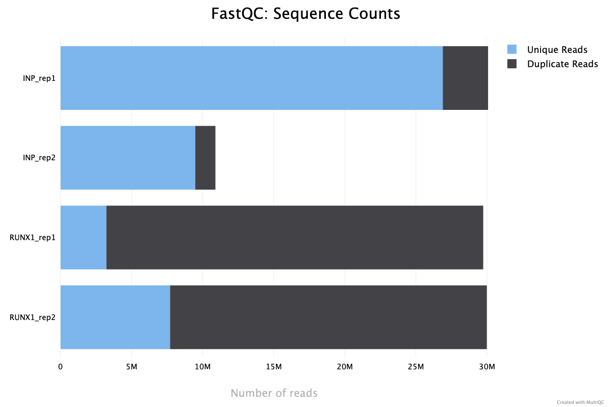
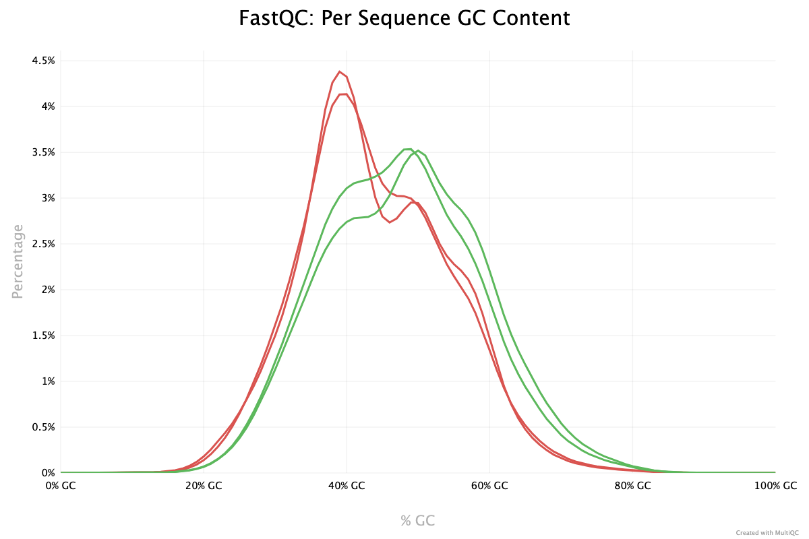
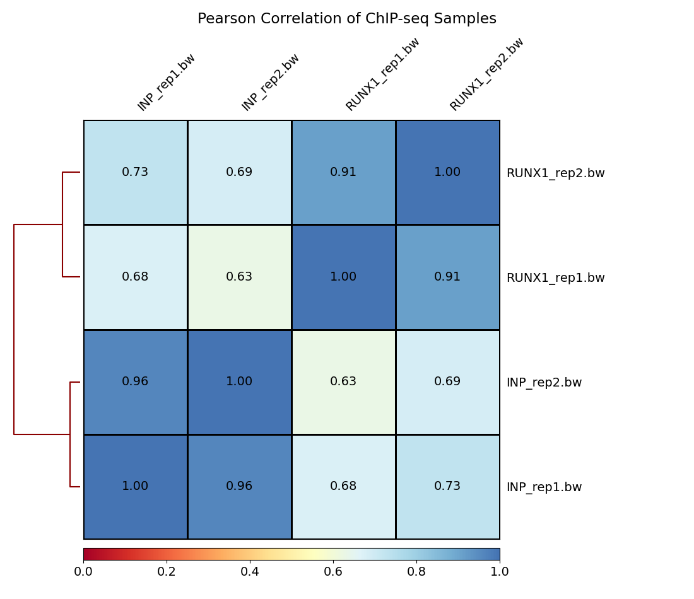
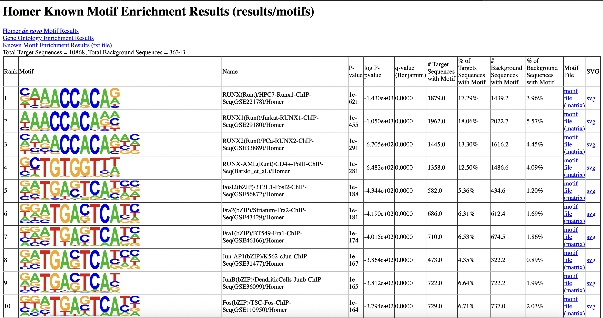
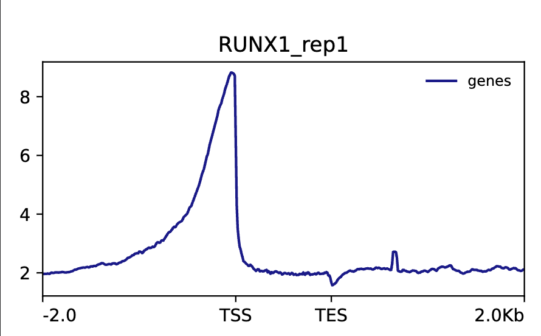
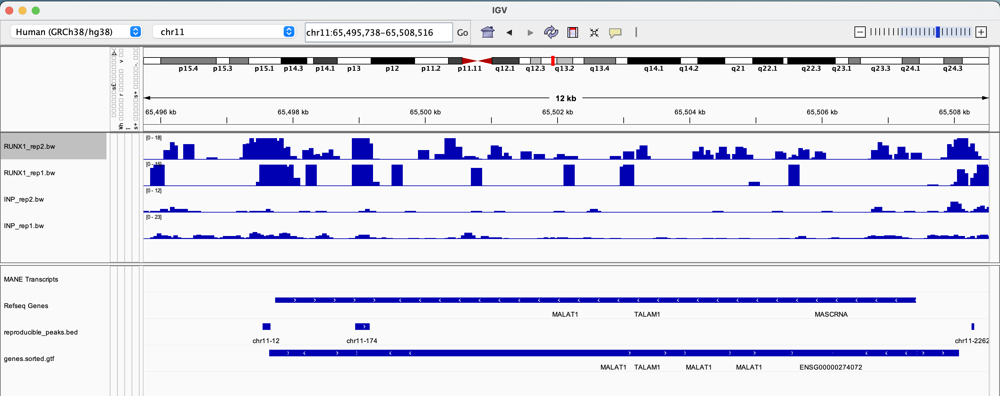

Please take some time and answer the following questions. You'll notice that
some questions are more theoretical and may require you to do a little research.
Feel free to also discuss with your classmates. After submission, we will
provide you feedback and allow you to resubmit. We will also go through the
questions together during class after resubmission.


**Methods and Quality Control**

1. Include a full methods section for this project. You may simply combine
the individual methods sections you've written for each week.

Methods

## Quality Control

For quality control, we utilized FastQC, a tool for assessing the quality of high-throughput sequencing data. FastQC generates a comprehensive report containing various metrics such as per-base sequence quality, per-sequence quality scores, GC content, and sequence length distribution. These metrics allow us to identify potential issues with the sequencing data, such as adapter contamination, overrepresented sequences, and sequence biases.We executed FastQC on the raw sequencing reads to evaluate their overall quality and identify any anomalies that may affect downstream analyses. This step helps in making decisions regarding data preprocessing and filtering.

## Trimming

Trimming of sequencing reads is essential to remove adapter sequences, low-quality bases, and other artifacts that may interfere with downstream analysis. We employed Trimmomatic, a tool for read trimming and quality filtering. The Trimmomatic parameters used for trimming are as follows:
- **ILLUMINACLIP**: Adapter sequences were removed using a predefined adapter file to eliminate any residual adapter contamination. We used a mismatch error rate of 2, a palindrome clip threshold of 30, and a simple clip threshold of 10.
- **LEADING**: Trims low-quality bases from the beginning of the reads to improve the overall quality of the data. The quality threshold was set to 3.
- **TRAILING**: Trims low-quality bases from the end of the reads to enhance the reliability of downstream analyses. The quality threshold was set to 3.
- **SLIDINGWINDOW**: Applies a sliding window approach to trim bases with average quality scores below a specified threshold, thereby improving the overall quality of the reads. We used a window size of 4 and a required quality of 15.

## Building a Genome Index

Alignment of sequencing reads to the reference genome is a crucial step in ChIP-seq data analysis. 
Prior to alignment, a genome index using Bowtie2 was built, a fast and memory-efficient aligner.
The Bowtie2 index allows for rapid and efficient alignment of sequencing reads to the reference genome. 
We used the GRCh38 chr 2 fasta file to construct the index, ensuring compatibility with the reference genome used in our analysis.

## Aligning Reads to the Reference Genome

We aligned the sequencing reads to the human reference genome using Bowtie2, leveraging the index 
generated in the previous week. By default, Bowtie2 outputs in SAM format, which we converted to BAM 
format using Samtools for better efficiency and disk space utilization.

## Sorting and Indexing Alignment Files

To facilitate downstream analyses such as visualization and random access, we sorted and indexed all 
generated BAM files using Samtools. Sorting and indexing enable efficient data retrieval and manipulation.

## Quality Control with Flagstats and MultiQC

We performed quality checks on the alignment using Samtools flagstat to obtain essential statistics 
regarding alignment quality. Additionally, we utilized MultiQC to aggregate and visualize quality control information generated from various tools used throughout the workflow.

## Generating BigWig Files and Comparing "Similarity" Between Samples

To analyze and visualize the signal across the genome, we converted aligned BAM files to bigWig format using Deeptools' bamcoverage utility. Furthermore, we computed Pearson correlation values between samples' signal using multiBigWigSummary and plotCorrelation utilities in Deeptools. This comparison helps assess the similarity between samples and identify any discrepancies.

## Generating Tag Directories with HOMER

We generated tag directories for each sample using the `makeTagDirectory` command in HOMER. Each sample has its separate tag directory. All options were left at default parameters.

## Peak Calling with HOMER's findPeaks

We performed peak calling using HOMER's `findPeaks` command on both of our replicate experiments. We used the input as our background enrichment control. 

## Converting HOMER Output to BED Format

The output of `findPeaks` is in a HOMER-specific format. We converted this .txt HOMER peak file to a standard BED formatted file using the `pos2bed` utility.

## Determining Reproducible Peaks with Bedtools

We used Bedtools to generate a single list of "reproducible peaks" from our two peak files. We employed a strategy based on the intersection of peaks from replicates. The intersection strategy was used to determine reproducible peaks because it offers a method for identifying peaks that are consistently present across replicates.

## Filtering Signal-Artifact Regions

We filtered out any reproducible peaks that fall into blacklisted regions using Bedtools. This step aims to remove noise and signal-artifacts from our peak lists.

## Annotating Peaks to Genomic Features

We performed peak annotation using the `annotatePeaks.pl` utility in HOMER to assign peaks to their nearest genomic features. We provided the decompressed GTF file for annotation.

## Motif Finding with HOMER

Using the set of reproducible peaks, we performed motif finding using HOMER's `findMotifsGenome.pl` to identify enriched motifs in our peak locations. We provided the path to the FASTA file of the human reference genome.

## Obtaining Genomic Coordinates of RefSeq Genes

First, we were required to download a BED file containing the genomic coordinates of all RefSeq genes for the human reference genome using the UCSC Table Browser.

## Processing RNA-seq Differential Expression Results

We downloaded the processed differential expression results for the RNA-seq experiment performed in Figure 1 of the paper. We applied the same filters and cutoffs as in the original paper to generate a dataframe containing only the significantly differentially expressed (DE) genes.

## Generating Signal Matrices with Deeptools

We created a Snakemake rule that utilizes the Deeptools `computeMatrix` utility, the BED file of hg38 genes, and the previously generated bigWig files to generate matrices of signal values.

## Visualizing Signal Across Genes

Next, we created a Snakemake rule that utilizes the Deeptools `plotProfile` utility to generate a simple visualization of the signal across hg38 genes using the matrix outputs from the `computeMatrix` step.

2. Examine the figure provided below:
```{r, dup rate}

```
Notice the duplication rates between the IP (Runx1) and Input control samples.
Provide an explanation for why they are so different. Also make sure to note
whether you think this represents an issue with the dataset, and if so, why?.

Duplication rates in IP (Runx1) samples are typically higher than in input control samples because the IP process enriches for DNA fragments bound by Runx1, leading to repetitive sequencing of the same regions. This can be an issue as it may skew peak calling results and impact the reliability of the data.


2. Examine the figure provided below:
```{r, GC content}

```
Consider the GC plot for the IP and Input control samples. The two input samples
are represented by the red distributions, and the IP samples are the green
distributions.

Why do you think we see a difference in the GC distribution between our IP and
Input control samples? Also make sure to note whether you think this represents
an issue with the dataset and if so, why?

The difference in GC distribution between IP and input control samples is likely due to the selective enrichment of certain genomic regions in the IP samples that are bound by the Runx1 transcription factor. These regions may have a specific GC content profile that differs from the broader, more diverse range of sequences in the input control samples.  

This difference can be an issue because it may indicate a bias in the IP sample towards sequences with a certain GC content. This bias can affect peak calling and interpretation of the data, potentially leading to underrepresentation or overrepresentation of certain genomic regions. It is important to account for this GC bias during downstream analysis.


**Thought Questions on Publication**

The following questions will reference the original publication, which can be
found here: https://www.ncbi.nlm.nih.gov/pmc/articles/PMC5071180/

3. First, please report the following results:
  
A. How many peaks were called in each of the biological replicates in your
results?
  
rep1 peaks: 106072
rep2 peaks: 50952  
  
B. How many "reproducible" peaks did you end up with after applying your
bedtools intersect strategy on the two replicate peak sets?
     
reproducible peaks: 10924     
     
C. How many "reproducible" peaks remained after filtering out any peaks found in
the hg38 blacklisted regions?
     
peaks after filtration: 10785

Consider Supplementary Figure S2C, do you obtain the same number of Runx1
peaks for each replicate experiment? Do you obtain the same number of
reproducible peaks? If not, provide at least three reasons why your results
differ.

Based on the data in the paper, the number of peaks identified in each biological replicate in the results differs significantly from the peaks reported in Supplementary Figure S2C.

The differences could be due to different peak-calling parameters where the parameters used for peak calling, such as thresholds for significance, might differ between the analysis and the analysis that led to the data in Supplementary Figure S2C. Additionally, data processing and filtering which focuses on how data is processed and filtered can vary significantly between analyses. Different approaches to removing low-quality reads, controlling for noise, or using specific peak filtering strategies can lead to differences in the number of peaks called and identified as reproducible.


4. Consider figure 2a, notice that around 1/3 of all of their reported
reproducible peaks are annotated to intergenic regions (regions of the genome
not associated with any known genes). Propose at least two experiments (or sets
of experiments) that would help you begin to understand whether these peaks are
biologically relevant.

We can perform functional genomic annotation.
Chromatin State Mapping: Conduct experiments such as ChIP-seq or ATAC-seq using different chromatin modification markers to determine if these intergenic peaks correspond to regulatory regions such as enhancers. If the peaks are associated with active chromatin states, this suggests a potential regulatory function. 
DNA Methylation Analysis: Perform whole-genome bisulfite sequencing to assess DNA methylation levels in intergenic regions. Differentially methylated regions in intergenic areas can indicate regulatory functions and potential biological relevance.


5. Consider figure 2f, note that many of the genes that are differentially
expressed upon Runx1 knockdown do **not** have a proximal Runx1 binding peak.
Provide at least three reasons for why this might be the case.

The reasons why many differentially expressed genes upon RUNX1 knockdown do not have a proximal Runx1 binding peak include:  

Long-Range Gene Regulation: RUNX1 might bind to distant enhancers and regulate gene expression through looping mechanisms, interacting with genes located far from the binding site. 
Indirect Regulation: RUNX1 knockdown could alter the expression of other transcription factors, which in turn influence genes not directly bound by RUNX1.
Technical Limitations: Sensitivity of detection methods may not capture all RUNX1 binding sites, particularly those with weaker binding affinities, leading to underestimation of its binding.


**Reporting your results**

For the next section, please include the requested figures you generated from
your workflow. For results that are not already a plot / image file, take a
quick screenshot and include it here. Make sure you push these images to this
github classroom repo and include the name / path in the
knitr::include_graphics() function provided. 

Please display your correlation plot displaying the overall similarity between
your sample files based on the read coverage scores across genomic regions:
```{r, correlation heatmap from plotCorrelation}

```

Please include a screenshot of the top ten results from the knownResults output
from motif finding with HOMER findMotifsGenome:
```{r, motif results from findMotifsGenome}

```

Please include the signal coverage plot you generated in week 4. This is the 
output of plotProfile that shows the density of Runx1 binding across all of the
hg38 gene bodies. You only need to show one representative plot:
```{r, signal coverage plots from plotProfile}

```


Please include one of the screenshots of the genome browser view of either the
MALAT1 or NEAT1 locus with your bigWig files and BED file. You only need to
include one:
```{r, NEAT1 or MALAT1 genome browser view with tracks}

```
