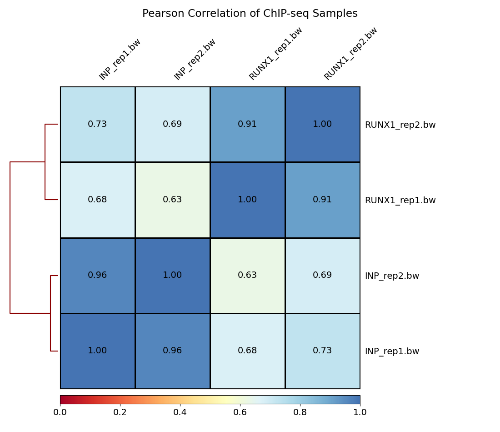

Use this notebook to quickly write the methods for the week:

## Introduction

In Week 2, our focus shifts to aligning sequencing reads to the human reference genome using Bowtie2, 
followed by sorting, indexing, and performing quality control on the aligned files. Additionally, we 
generated bigWig files to visualize the signal across the genome and compare the similarity between 
samples using Pearson correlation.

## Aligning Reads to the Reference Genome

We aligned the sequencing reads to the human reference genome using Bowtie2, leveraging the index 
generated in the previous week. By default, Bowtie2 outputs in SAM format, which we converted to BAM 
format using Samtools for better efficiency and disk space utilization.

## Sorting and Indexing Alignment Files

To facilitate downstream analyses such as visualization and random access, we sorted and indexed all 
generated BAM files using Samtools. Sorting and indexing enable efficient data retrieval and manipulation.

## Quality Control with Flagstats and MultiQC

We performed quality checks on the alignment using Samtools flagstat to obtain essential statistics 
regarding alignment quality. Additionally, we utilized MultiQC to aggregate and visualize quality control 
information generated from various tools used throughout the workflow.

## Generating BigWig Files and Comparing "Similarity" Between Samples

To analyze and visualize the signal across the genome, we converted aligned BAM files to bigWig format using 
Deeptools' bamcoverage utility. Furthermore, we computed Pearson correlation values between samples' signal 
using multiBigWigSummary and plotCorrelation utilities in Deeptools. This comparison helps assess the similarity
between samples and identify any discrepancies.

## Conclusion

In Week 2, we successfully aligned sequencing reads to the reference genome, performed sorting and indexing of 
alignment files, conducted quality control checks, and generated bigWig files for visualization. Additionally,
we compared the similarity between samples using Pearson correlation analysis. These steps lay the foundation 
for further downstream analysis.


If asked, you may also include any plots or figures in this notebook as well:

```{r, your image here}

```
