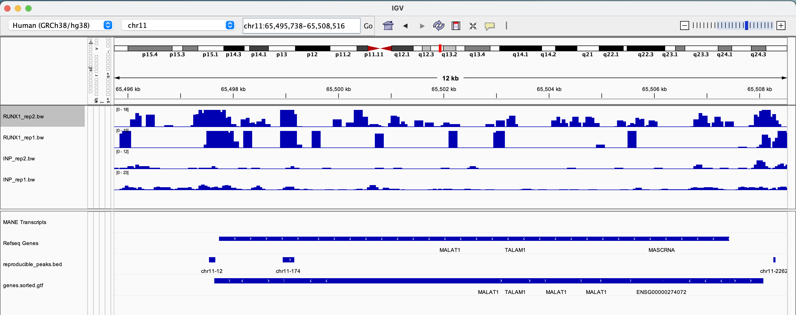
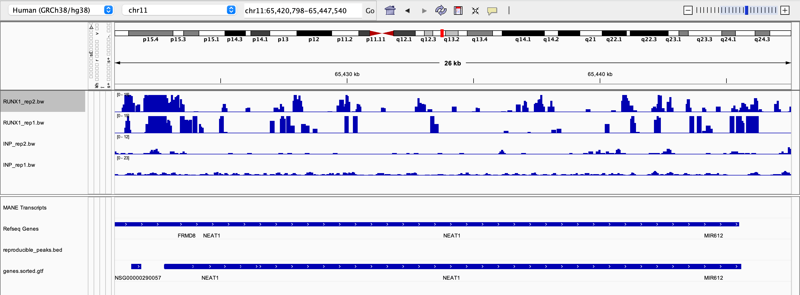

Use this notebook to quickly write the methods for the week:

## Introduction

In Week 4, we continued our analysis of ChIP-seq data and integrate it with RNA-seq results. We also visualized 
the signal coverage across gene bodies using bigWig files.

## Methods

## Obtaining Genomic Coordinates of RefSeq Genes

First, we were required to download a BED file containing the genomic coordinates of all RefSeq genes for the human reference 
genome using the UCSC Table Browser.

## Processing RNA-seq Differential Expression Results

We downloaded the processed differential expression results for the RNA-seq experiment performed in Figure 1 of the paper.
We applied the same filters and cutoffs as in the original paper to generate a dataframe containing only the significantly 
differentially expressed (DE) genes.

## Generating Signal Matrices with Deeptools

We created a Snakemake rule that utilizes the Deeptools `computeMatrix` utility, the BED file of hg38 genes, and the 
previously generated bigWig files to generate matrices of signal values.

## Visualizing Signal Across Genes

Next, we created a Snakemake rule that utilizes the Deeptools `plotProfile` utility to generate a simple visualization 
of the signal across hg38 genes using the matrix outputs from the `computeMatrix` step.

## Conclusion

By the end of Week 4, we processed the RNA-seq results, generated signal matrices, and visualized the signal coverage 
across gene bodies, allowing us to gain insights into the regulatory mechanisms associated with the factor of interest.


If asked, you may also include any plots or figures in this notebook as well:

```{r}
knitr::include_graphics("RUNX1_rep1_coverage_plot.pdf")
```

```{r}
knitr::include_graphics("RUNX1_rep2_coverage_plot.pdf")
```

```{r}

```

```{r}

```

According to the study which found that when a certain gene called RUNX1 is turned off, 
two other genes called NEAT1 and MALAT1 also become less active. This suggests that RUNX1 might 
directly control the activity of NEAT1 and MALAT1. Since NEAT1 and MALAT1 play important roles in 
how cells are organized and in cancer development, this decrease in their activity could be significant 
in understanding cancer. 

According to the screenshots above, we can conclude that the genes NEAT1 and MALAT1 become less active when
the RUNX1 gene is turned off. It means that the genes are downregulated when RUNX1 is absent which indicates 
a direct involvement in their transcriptional regulation